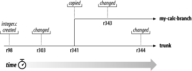

class: center, middle, white
background-image: url(img/premieredecouv.png)

# Qui a dit que les pingouins
# ne savaient pas voler ?

### N’adoptez pas d’outils ! Refusez tout process ! Créez les vôtres !

Agile Grenoble - 20 novembre 2014

???

* Bonjour [...]
* CH: pour votre culture, un manchot ça nage et un pingouins, ça vole
* LLa: je vais commencer par vous parler de singes et de bananes

Qui a dit que les pingouins ne savaient pas voler ?
N’adoptez pas d’outils ! Refusez tout process ! Créez les vôtres !

Démos d'outils et retours d'expérience sur l'évolution d'un workflow XP et Scrum pour des collaborateurs distants.
Objectif de la session: 	L'envie d'essayer, de se lancer, d'arrêter d'hésiter et de discuter !
Public visé:	[Claire et Laurent, scrummaster et développeur] (attente personas)
Niveau requis:	Pratiques et concepts de base de l'agilité et du développement avec expérience d'une équipe de développement.
Type de session:	50 min Session en français

Nous rêvons de passer notre temps à créer et tester nos idées tout en suivant l’évolution des besoins des utilisateurs. Cependant des obstacles se dressent sur notre chemin ! Des clients se permettent de nous appeler pour des problèmes, des commerciaux veulent de nouvelles fonctionnalités bizarroïdes, nous devons gérer des branches, des tickets, tester les régressions et nouveaux développements, écrire de la doc, saisir nos temps de travail. Aaaaaaaaaahhh, avec tout ça, nos envies nous échappent !

Il n’existe aucun outil, aucune méthode ou pratique magique pour tout réaliser à notre place, car notre situation est unique ! Comme toutes les entreprises et projets, n’est ce pas ? Nous voulons créer ? Créons des outils et workflows qui nous correspondent, qui limitent le temps passé sur des tâches rébarbatives et nous permettent de prendre les décisions les mieux adaptées chaque jour !

Le rapprochement de AFI et BibLibre, deux éditeurs de logiciels libres s’inspirant de pratiques différentes, a amené à créer une nouvelle équipe géographiquement répartie pour continuer le développement d’un produit. Nouveaux obstacles, nouveaux défis, nouveaux besoins, nouveaux workflows, mais pas d’outil pour les supporter.

Nous pensons que créer ses outils n’est pas une perte de temps et fait partie du processus de développement. Démos et retour d'expérience dans le monde d'un produit web personnalisable chez plus de 150 bibliothèques, mis à jour à chaque itération: non regression visuelle des applications web (phantomcss, casperjs), meilleure synchronisation en remote pair programming (tmux, bash), non régression des traitements de masse (phpunit), aide à la décision pour l'évolution des processus (pharo, moose, redmine), automatisation de l'environnement de développement et de déploiement (emacs, vim, git).

Vous serez projetés dans notre quotidien, nous espérons que ça vous poussera à enfoncer des portes, essayer des choses et bannir les "on ne peut pas".

---
class: bigger
background-image: url(img/singe_bananes.png)

# Des singes et des bananes

???

* des singes et 1 banane, si un singe part, on arrose ceux qui restent, au fur et à mesure on remplace les singes, à la fin ils se retiennent, mais ils ne savent plus pourquoi.
* Commencer par raconter une histoire.
* Remettre en cause toujours ce qui est établi
* Ce qui était efficace avant ne l'est plus aujourd'hui

=> on a besoin de remettre en cause ce qui est établit et d'adapter nos pratiques au contexte

---
background-image: url(img/sommaire_historique.png)

???
* envie de vous raconter notre histoire, moi je suis [...] et voici [...]
---
background-image: url(img/context_2_devs_2_light.png)

# Afi-Opac en 2010...

--

* un portail pour les bibliothèques

--

* produit propriétaire d'AFI

--

* 1 développeur

--

* une installation en production

--

* 1 chef de projet à temps partiel


---
background-image: url(img/context_lot_2_light.png)

# ...vers  en 2014

--

* 

???

en 2014, le produit est un logiciel libre, il est sous license ...

--

* 

--

* 7 Développeurs, 1 Scrummaster, 1 Product Owner

--

* 3 Hotliners, 3 Chefs de projet

--

* ~180 installations et 100 dépôts git

--

* itérations 2 semaines

--

* ~8 mises à jour des clients par mois

???
2 versions majeures + des mineures

---
background-image: url(img/sommaire_valeurs.png)
---
class:bigger
background-image: url(img/penguin_computer.png)
# Pourquoi développons nous du logiciel (libre)?

???

interactif: pour ceux qui développe ici, pourquoi le faites vous ? pourquoi avez vous choisi de le faire

* Proposer 1 minutes eggtimer : après recul, ça l'a fait moyen...

--

* Passer du temps à créer et non répéter 

???

ce qui nous amuse c'est de créer...

--

* Pour que nos clients satisfassent leurs utilisateurs

???
transition avec suivant: notre prez est axée sur les outils, il faut bien comprendre qu'ils ne servent que de support à l'interaction
---
background-image: url(img/agile_manifesto_zoom.png)

???

transition : notre prez est axée sur les outils, il faut bien comprendre qu'ils ne servent que de support à l'interaction

* donner de l'importance en priorité aux individus, mais ne pas en donner aucune au reste
* avant tout et de se lancer, avoir une équipe alignée et soudée qui communique !
* les outils 
 * sont là pour donner toute la place et l'efficacité à l'équipe
 * les outils vont faciliter la coopération et la communication
 * ils nous aident à terminer le travail à faire

---
class: center,top
background-image: url(img/plan_light.png)

#  Contextualiser les prises de décisions, les processus et les outils

???

* Comment
  * Créer des outils contextuels
  * démarche non "copier/collable" (ex: TU sur entreprise)
  * Adaptation des outils et process à son contexte et non l'inverse
  * à chaque nouvelle personne qui entre ou part ou nouveau client, l'équilibre est modifié et les outils doivent s'adapter
---
class: center,middle
background-image: url(img/parachute_light.png)
# Démarche plutôt que les outils

???

* montrer le chemin emprunté pour sensibiliser / faire réagir
* démarche d'amélioration continue : rétrospectives
* volonté de ne pas passer du temps à re-faire, mais d'automatiser pour passer plus de temps sur la valeur ajoutée

---
class: center,top
background-image: url(img/experimenter_light.png)

# Ne pas refaire le monde qu'aux poses café, mettre en pratique par petits pas

???

* "Il faut que", "Si seulement j'avais", "c'est compliqué de", "j'ai pas le temps"
* important d'avoir un suivi pour ne pas retomber dans le travers "y a qu'à faut qu'on"
---
background-image: url(img/sommaire_enpratique.png)

???

attention scénette à venir > claire au pc et laurent arrive

---
class: bigger
background-image: url(img/context_2_devs_2_light.png)

# Revenons en 2010...

???


Plan: contexte / problématique avec participation / nos choix

---
background-image: url(img/context_2_devs_2_light.png)

# Contexte

???

lla & clrh scénette

* salut moi c'est laurent je viens travailler avec toi sur l'opac
* moi c'est Jean et je travaille depuis 25 ans
* et c'est bien ? oui, c'est magnifique
* il est où le code source
* il est là tu vois dans C:.. et pour mettre à jour le serveur
* et donc on va travailler ensemble, on fait comment ?.
* ben je te file les fichiers par mail ou tu me passes une clé ?

--

* un développeur

--

* code source dans un dossier

--

* mise à jour par FTP

--

* code legacy

--

* 1 client actuel et 1 futur

---
background-image: url(img/outils_light.png)
# Problématique

### un nouveau développeur arrive pour travailler sur le projet

### >>> Comment travailler sur le même code source, livrer des versions ?


???

* Observer pour voir si ça va vers du "surprocessing"
---
# Notre choix

* SVN

.center[]

???

* ne pas faire au delà de ce qui nous apporte de la valeur
* prise en compte du temps d'adoption, commencer simple et accessible
* ne pas mettre en place plus de choses que nécessaire (pas de capistrano, chef, puppet, ....)

---
background-image: url(img/pendant_ce_temps.png)
# Entre temps

* Notre Forge est sous Redmine (gestionnaire de tickets)

--

* Editeur CSS accessible client

--

* Cosmotalk (monitoring métier des installations)
--

* phafi-mode (Personnalisation d'Emacs)

--

* Instauration d'un rythme itératif d'une semaine
--

* Mise en place d'un bac à sable


---

# Storm

ORM focalisé sur la testabilité et l'intégration au code legacy.

```php
// Crée un objet en mémoire
$this->fixture('User', ['id' => 4,
                        'login' => 'foo',
                        'password' => 'secret']);

// Propage la requête et récupère le HTML
$this->dispatch('/users/edit/id/1');

// Teste le HTML retourné
$this->assertXPath('//input[@name="login"][@value="foo"]');
```

???

* introduction de bcp de TDD + pairprog

---
class:white
background-image: url(img/context_lot.png)
# début 2014
---
# Contexte

???

clrh & lla : scénette
* arrivée clrh, devs 
* dring / dring > salut, c'est claire je voulais savoir...
* vous avez prévu quoi cette semaine ? ...
* et c'est fini quand ? pfff le patron voulait peut être qu'on bosse sur autre chose
* et les clients ? ben lui il est super sympa... hackaton / bières
* et je peux suivre ça où ? sur mes notes

--

* Rapprochement de 2 entreprises: AFI & BibLibre

--

* 4 développeurs colocalisés travaillant en pair programming et TDD

???

4 devs à annecy, 1 en creuse, 1 à strasbourg, le po à lyon...
bordeau etc.
--

* enrichissement de l'équipe par 1 scrummaster, 1 product owner et 3 développeurs distribués

--

* Nombre de clients ~ 140
---

background-image: url(img/outils_light.png)
# Problématique

### Comment travailler sur le même code source, livrer des versions ?

???

question à la salle

Ne pas oublier la notion de la transmission du savoir
---
class:center,middle
# Nos choix

---
class: middle, left
# Madagascar


???

* wemux/temux
---
class: bottom, left
background-image: url(img/tools/forge_scrum.png)
# Scrum pour le dev du produit

???


* roulement adapté en fonction des envies du matin

---
class: bottom, left
background-image: url(img/tools/forge_hotline.png)
# Kanban pour la hotline

---
class: bottom, left
background-image: url(img/tools/gitlab_public.png)

# Gitlab

???

* utiliser git
* gérer des contributeurs externes
---
class: bottom, left
background-image: url(img/big_red_button_flickr_wlodi_1024_transparent.jpg)
# Script de déploiement

???

* Automatisation des tâches répétitives pour que "ça marche chez tous"
* Permettre un déploiement continu

---
background-image: url(img/pendant_ce_temps.png)
# Entre temps 2

en parrallèle du travail collaboratif, d'autres outils ont été adaptés

???

* avant: solutions pour répondre au besoin de travail en équipe
* en parrallèle, d'autres outils ont été mis en place et développés

---
# Redmine Scripts


???
* avoir une vue d'ensemble sur la masse de tickets
* dev en cours
* smalltalk / pharo

---
# Wiki


???

* mise en commun de la doc

---
class: white
background-image: url(img/lancement.png)

# Et après ?

???

clrh & lla : scénettes

* CH: Salut Mireille
* MC: Salut Claire
* MC: j'ai lancé une intégration de fichiers, ça a mis 2j et ça amrche toujorus  pas et là j'en ai 15 à passer, ça vient d'où le problème (ws/client/presat...)?
* CH: rappelle moi le numéro de la demande... ok il est pris en charge actuellement
* MC: régressions ? la boite de connexion qui ne s'affiche plus - ça marche pas depuis la dernière mise à jour
* CH: Patrick est en train de solidifier les tests pour ce cas, c'est difficile à reproduire
* MC: Patrcik m'a dit qu'il n'y aurait plus de bug !


---
# Contexte

--

* Volume client tend vers 200 installations fin 2014

--

* Beaucoup de personnalisations graphiques

--

* Volume dev de + en + important

---
background-image: url(img/outils_light.png)
# Problématique

### Besoin d'être efficace en maintenance
### >>> Comment limiter les régressions ?

???

question à la salle
---
class:center,middle

# Nos choix

---

# Negative - non-régressions des intégrations

???

par intégration, on entends ...

--


---
# Pique - régressions de rendu


--


---

# BOkeh SHell - c'est bien, c'est beau, c'est Bosh

???

* lancer un script dans un contexte particulier
* automatiser les manipulations qu'on fait souvent

--

```bash
$ bosh info
Version 6.56.0
Database : miop_test
URL Rewriting: disabled
```

---

# Inspector Gadget

--


???

* outil d'analyse
* outil / débuggeur de code
* analyse des données ou process
* ex: webservices prestataires


---
background-image: url(img/sommaire_revevsrealite.png)
---
background-image: url(img/catapulte_light.png)
class: center,bottom

# Comment passer du rêve à la réalité ?

???
ÊTRE à 22/23 MINUTES
---
class:white
background-image: url(img/tools/bac_a_sable.png)

# #1 Instauration de notre "Bac à sable"

--

## une aprem par sprint

--

## un espace d'expérimentation

--

## avec un point de synchro et une démo pour débrieffer

--

## facultatif et en fonction des priorités du support

???

[émotion, stimulation, autonomie, créativité, inspiration, ...]
---
background-image: url(img/tools/backlog_outils.png)

# #2 Faire remonter les besoins au backlog

--

## exliquer le risque de ne rien faire

--

## expliquer l'impact de le faire

--

## essayer d'en faire passer un petit bout à chaque planification

--

## rencontre plus de résistance
---
class: white,right,top
background-image: url(img/indicateur.png)

# #3 Auto-gestion


```
n'oubliez pas...
pour avant, c'est trop tard
pour après, c'est trop tôt
la vie est là où l'on est..
vivement maintenant !!!
```

.bold[Feeling + Timing + Opportunité (Confiance++)]

???

* Avant, c'était tout le temps
* Maintenant, on force de le rendre visible
* Impression d'en faire moins aujourd'hui, mais plus d'outils
* Comment faire aujourd'hui pour refactorer ? grosses choses ex: profil et API (storm)

* besoin de lacher prise
* confiance vs trop d'encadrement donc pas de liberté de créer

(point de bascule à Marseille)
---

class: white,bigger
background-image: url(img/end1_light.png)


#### http://wiki.bokeh-library-portal.org
#### http://git.afi-sa.fr/afi/opacce

### Laurent Laffont chez AFI @lolgzs
### Claire Hernandez chez BibLibre @clrh


???
images: https://github.com/gnab/remark/wiki/Formatting#images
background-image: https://github.com/gnab/remark/wiki/Markdown#background-image

---
background-image: url(img/vaisselle_light.png)
class: white

# Le coffre à jouets...

* Dépôts communautaires - Contrôle de version (Gitlab)
* Editeur CSS accessible client (Amber - Smalltalk)
* Cosmotalk - monitoring métier des installations (Seaside - Smalltalk)
* phafi-mode - Personnalisation d'Emacs (lisp)
* Test Driven Development
* Pair programming
* Livraisons régulières
  * Scrum 2 semaines
  * Hotline en Kanban
* Bac à sable
* Storm - ORM TDD legacy (php)
* Madagascar - paiprog à distance (tmux / wemux)
* Scripts d'automatisation (Ansible - BOSH)
* RedmineScript - Analyse et visualisation des tickets (Pharo - Smalltalk)
* Wiki - Documentation communautaire (Mediawiki)
* Negative - non-régressions des intégrations (phpunit)
* Pique - régressions de rendu (casperjs, phantomcss)
* Inspector Gadget - debug en prod efficace (php - js)

???
Quelques feedbacks après la session:
* certains concepts comme tmux passent à des années lumières des personnes, aurait mérité de zoomé et d'expliquer / s'adapter plus à la salle (ex: partage d'écran sur un serveur > insister et répéter)
* "si on m'avait dit que ce serait technique, je ne serais pas venue, ce qui m'intéressait c'était les tests, je suis testeuse"
*
